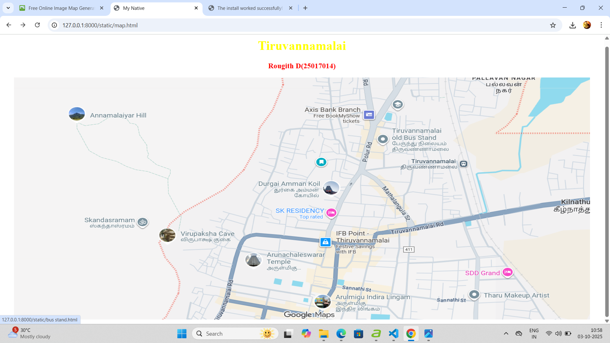
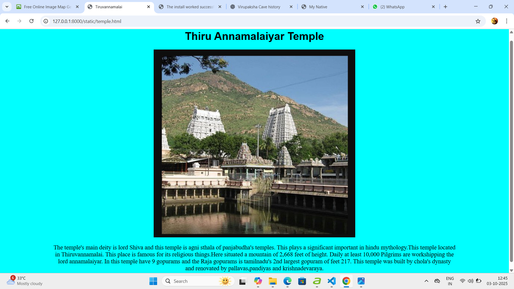
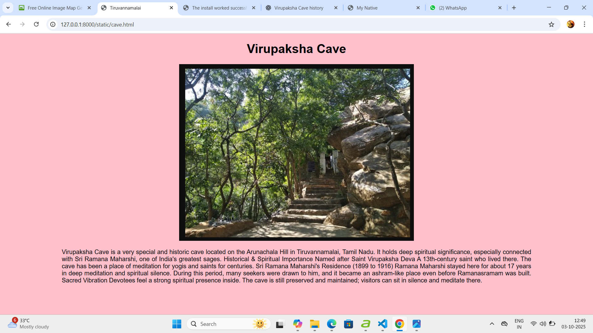
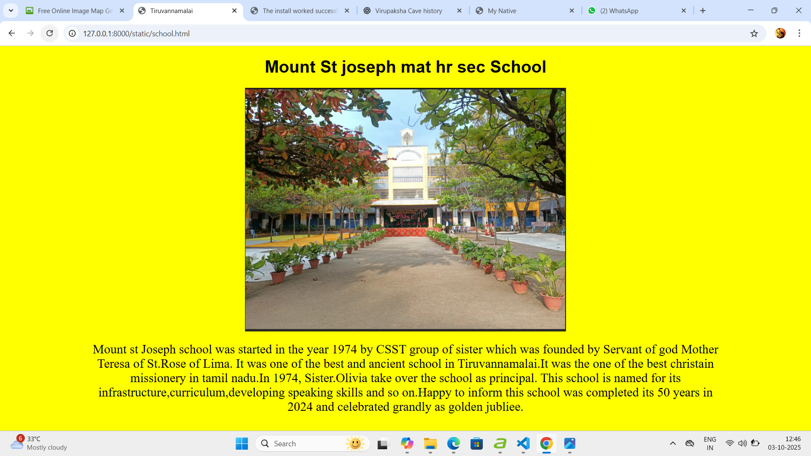
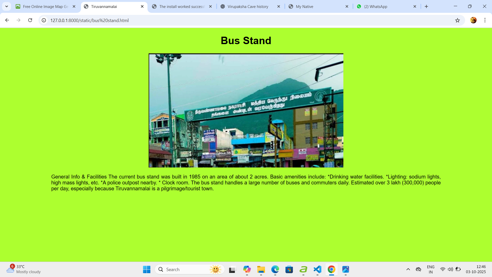
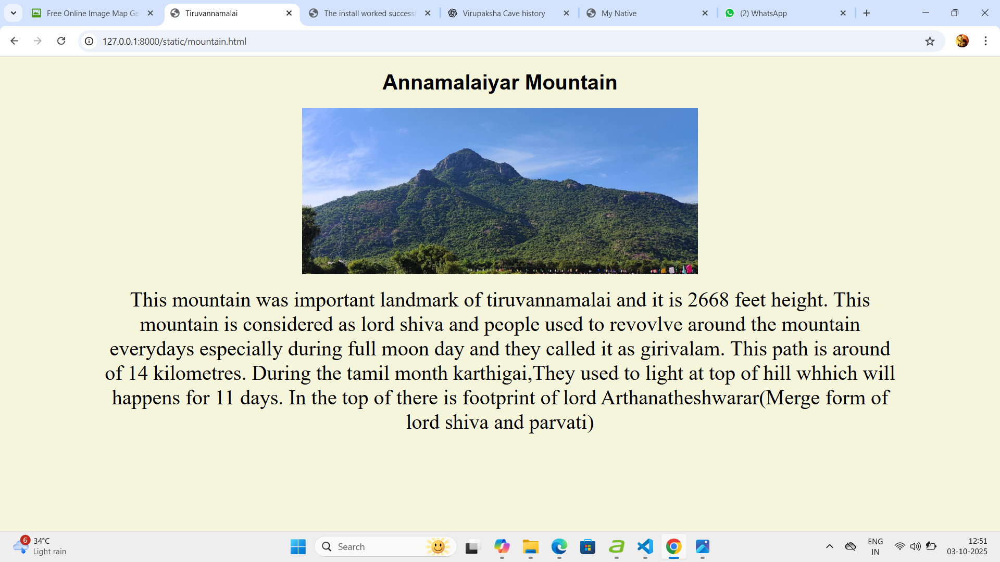

# Ex04 Places Around Me
# Date:02\10\25
# AIM
To develop a website to display details about the places around my house.

# DESIGN STEPS
## STEP 1
Create a Django admin interface.

## STEP 2
Download your city map from Google.

## STEP 3
Using <map> tag name the map.

## STEP 4
Create clickable regions in the image using <area> tag.

## STEP 5
Write HTML programs for all the regions identified.

## STEP 6
Execute the programs and publish them.

# CODE
'''
map.html
<!DOCTYPE html>
<html>

<head>
    <title>My Native</title>
</head>

<body>

    <h1 align="center">
        <b>Tiruvannamalai</b>
    </h1>
    <h3 align="center">
        <b>Rougith D(25017014)</b>
    </h3>
    

        
        <map name="#MyNative">
            <area shape="rect" coords="428,202,93,66" href="mountain.html" title="Annamalaiyar Mountain">
            <area shape="rect" coords="930,104,979,64" href="school.html" title="My School ">
            <area shape="rect" coords="570,587,745,514" href="temple.html" title="Annamalaiyar Temple">
            <area shape="circle" coords="265,490,440,417" href="cave.html" title="Virupaksha cave">
            <area shape="circle" coords="907,231,980,197" href="bus stand.html" title="Bus stand">
        </map>
    

</body>

</html>
temple.html
<!DOCTYPE html>
<html>

<head>
    <title>Tiruvannamalai</title>
    
</head>

<body>
    

        <h1>Thiru Annamalaiyar Temple</h1>
        
        
            The temple's main deity is lord Shiva and this temple is agni sthala of
            panjabudha's temples. This plays a significant important in hindu mythology.This temple located in
            Thiruvannamalai. This place is famous for its religious things.Here situated a mountain of 2,668 feet of
            height. Daily at least 10,000 Pilgrims are workshipping the lord annamalaiyar. In this temple
            have 9
            gopurams and the Raja gopurams is tamilnadu's 2nd largest gopuram of feet 217. This temple was built by
            chola's dynasty and renovated by pallavas,pandiyas and krishnadevaraya.
        
        

</body>

</html>

cave.html
<!DOCTYPE html>
<html>

<head>
    <title>Tiruvannamalai</title>
    
</head>

<body>
    

        <h1>Virupaksha Cave</h1>
        
        
        

            Virupaksha Cave is a very special and historic cave located on the Arunachala Hill
            in Tiruvannamalai, Tamil Nadu. It holds deep spiritual significance, especially connected with Sri
            Ramana Maharshi, one of India's greatest sages. Historical & Spiritual Importance Named after Saint
            Virupaksha Deva A 13th-century saint who lived there. The cave has been a place of meditation for
            yogis and saints for centuries. Sri Ramana Maharshi's Residence (1899 to 1916) Ramana Maharshi
            stayed here for about 17 years in deep meditation and spiritual silence. During this period, many
            seekers were drawn to him, and it became an ashram-like place even before Ramanasramam was built.
            Sacred Vibration Devotees feel a strong spiritual presence inside. The cave is still preserved and
            maintained; visitors can sit in silence and meditate there.
            
        

</body>

</html>

school.html
<!DOCTYPE html>
<html>

<head>
    <title>Tiruvannamalai</title>
    
</head>

<body>
    

        <h1>Mount St joseph mat hr sec School</h1>
        
        
            Mount st Joseph school was started in the year 1974 by CSST group of sister which was founded by Servant
            of god Mother Teresa of St.Rose of Lima.
            It was one of the best and ancient school in Tiruvannamalai.It was the one of the best christain
            missionery in tamil nadu.In 1974, Sister.Olivia take over the school as principal.
            This school is named for its infrastructure,curriculum,developing speaking skills and so on.Happy to
            inform this school was completed its 50 years in 2024 and celebrated grandly as golden jubliee.

bus stand.html
<!DOCTYPE html>
<html>

<head>
    <title>Tiruvannamalai</title>
    
</head>

<body>
    

        <h1>Bus Stand</h1>
        
        
        

            General Info & Facilities

            The current bus stand was built in 1985 on an area of about 2 acres.
            Basic amenities include:

            *Drinking water facilities.
            *Lighting: sodium lights, high mass lights, etc.
            *A police outpost nearby.
            * Clock room.
            The bus stand handles a large number of buses and commuters daily. Estimated over 3 lakh (300,000)
            people per day, especially because Tiruvannamalai is a pilgrimage/tourist town.

mountain.html
<!DOCTYPE html>
<html>

<head>
    <title>Tiruvannamalai</title>
    
</head>

<body>
    

        <h1>Annamalaiyar Mountain</h1>
        
        
            This mountain was important landmark of tiruvannamalai and it is 2668 feet height.
            This mountain is considered as lord shiva and people used to revovlve around the mountain everydays
            especially during full moon day and they called it as girivalam.
            This path is around of 14 kilometres.
            During the tamil month karthigai,They used to light at top of hill whhich will happens for 11 days.
            In the top of there is footprint of lord Arthanatheshwarar(Merge form of lord shiva and parvati)

'''

# OUTPUT

# RESULT
The program for implementing image maps using HTML is executed successfully.
